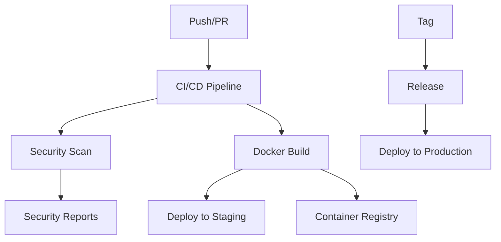

# GitHub Actions for Advanced Code Server

This directory contains comprehensive GitHub Actions workflows for CI/CD, security, and deployment automation.

## 🔄 Workflows Overview

### 1. **CI/CD Pipeline** (`ci.yml`)
**Trigger:** Push to main/develop, Pull Requests, Tags

**Features:**
- ✅ Multi-Node.js version testing (18.x, 20.x)
- 🐘 PostgreSQL and Redis service containers
- 🔍 Linting and type checking
- 🧪 Unit and integration tests
- 📊 Code coverage reporting
- 🔒 Security auditing
- 🐳 Multi-platform Docker builds (AMD64, ARM64)
- 🔐 Container vulnerability scanning
- 🚀 Automated deployments to staging/production

### 2. **Docker Build** (`docker.yml`)
**Trigger:** Manual dispatch, Push to main (src changes)

**Features:**
- 🐳 Multi-platform container builds
- 📦 GitHub Container Registry publishing
- 🏷️ Smart image tagging strategy
- 📋 SBOM (Software Bill of Materials) generation
- 🔍 Trivy vulnerability scanning
- 🔄 Build cache optimization
- 📝 Release automation

### 3. **Security Scanning** (`security.yml`)
**Trigger:** Weekly schedule, Push to main, Manual dispatch

**Features:**
- 🔍 Dependency vulnerability scanning (npm audit, Snyk)
- 🕵️ CodeQL static analysis
- 🔐 Secret detection (TruffleHog)
- 🐳 Container security scanning (Trivy, Grype)
- 📊 Security summary reporting
- 🚨 GitHub Security tab integration

### 4. **Kubernetes Deployment** (`deploy.yml`)
**Trigger:** After successful Docker build, Manual dispatch

**Features:**
- ☸️ Full Kubernetes deployment manifests
- 🗄️ PostgreSQL and Redis deployment
- 🔒 Secret management
- 🌐 Ingress with SSL/TLS
- 📊 Health checks and monitoring
- 🧪 Smoke testing
- 📈 Resource limits and scaling

### 5. **Release Management** (`release.yml`)
**Trigger:** Git tags (v*)

**Features:**
- 📝 Automatic changelog generation
- 📦 Release asset packaging
- 🐳 Docker image publishing
- 📋 Comprehensive release notes
- 🔔 Deployment notifications

## 🚀 Getting Started

### Required Secrets

Configure these secrets in your GitHub repository settings:

#### **Authentication & Security**
```bash
JWT_SECRET=your-jwt-secret-here
SESSION_SECRET=your-session-secret-here
POSTGRES_PASSWORD=base64-encoded-password
```

#### **OAuth Providers**
```bash
GITHUB_CLIENT_ID=your-github-oauth-client-id
GITHUB_CLIENT_SECRET=your-github-oauth-client-secret
GOOGLE_CLIENT_ID=your-google-oauth-client-id
GOOGLE_CLIENT_SECRET=your-google-oauth-client-secret
```

#### **Deployment**
```bash
KUBE_CONFIG=base64-encoded-kubeconfig-file
DOMAIN_NAME=your-domain.com
```

#### **Security Scanning** (Optional)
```bash
SNYK_TOKEN=your-snyk-api-token
```

### Setup Instructions

1. **Fork/Clone Repository**
   ```bash
   git clone <your-repo-url>
   cd advanced-code-server
   ```

2. **Configure Secrets**
   - Go to Settings → Secrets and variables → Actions
   - Add all required secrets listed above

3. **Enable GitHub Container Registry**
   - Ensure your repository has package write permissions
   - The workflows will automatically publish to `ghcr.io`

4. **Create Environments** (Optional)
   - Go to Settings → Environments
   - Create `development`, `staging`, `production` environments
   - Add environment-specific secrets and protection rules

## 🔧 Workflow Configuration

### Environment Variables
All workflows use these environment variables:
- `REGISTRY=ghcr.io` - Container registry
- `IMAGE_NAME=advanced-code-server` - Docker image name

### Customization Options

#### **Modify Node.js Versions**
Edit `.github/workflows/ci.yml`:
```yaml
strategy:
  matrix:
    node-version: [18.x, 20.x, 22.x]  # Add/remove versions
```

#### **Change Docker Platforms**
Edit platform targets in Docker workflows:
```yaml
platforms: linux/amd64,linux/arm64,linux/arm/v7
```

#### **Adjust Security Scanning**
Customize security thresholds:
```yaml
with:
  args: --severity-threshold=medium  # high, medium, low
```

## 📊 Workflow Outputs

### **Artifacts Generated**
- 📦 **Release Archives** - Complete deployment packages
- 📋 **SBOM Files** - Software Bill of Materials
- 📊 **Test Coverage** - Code coverage reports
- 🔍 **Security Reports** - Vulnerability scan results
- 🐳 **Container Images** - Multi-platform Docker images

### **GitHub Integrations**
- 🔒 **Security Tab** - Vulnerability alerts and reports
- 📦 **Packages** - Container registry integration
- 🏷️ **Releases** - Automated release management
- ✅ **Checks** - PR status checks and protection

## 🛠️ Manual Triggers

### **Deploy Specific Version**
```bash
# Via GitHub UI: Actions → Deploy to Kubernetes → Run workflow
# Or via GitHub CLI:
gh workflow run deploy.yml -f environment=production -f image_tag=v1.2.3
```

### **Build Specific Tag**
```bash
# Via GitHub UI: Actions → Docker Build and Push → Run workflow
# Or via GitHub CLI:
gh workflow run docker.yml -f environment=production -f tag=custom-tag
```

### **Security Scan**
```bash
# Via GitHub UI: Actions → Security Scan → Run workflow
# Or via GitHub CLI:
gh workflow run security.yml
```

## 🔍 Monitoring & Troubleshooting

### **Check Workflow Status**
```bash
# List recent workflow runs
gh run list

# View specific run details
gh run view <run-id>

# Download artifacts
gh run download <run-id>
```

### **Common Issues**

1. **Docker Build Failures**
   - Check Docker registry permissions
   - Verify Dockerfile syntax
   - Review build logs

2. **Deployment Failures**
   - Validate Kubernetes configuration
   - Check secret availability
   - Verify cluster connectivity

3. **Security Scan Failures**
   - Review vulnerability reports
   - Update dependencies if needed
   - Adjust scan thresholds if appropriate

## 📈 Performance Optimization

### **Build Cache**
- Workflows use GitHub Actions cache
- Docker builds use BuildKit cache
- Node.js dependencies are cached

### **Parallel Execution**
- Tests run in parallel across Node.js versions
- Security scans run independently
- Multi-platform builds use parallelization

### **Resource Limits**
- Kubernetes deployments include resource limits
- Containers have health checks
- Auto-scaling configuration available

## 🔄 Workflow Dependencies



## 📚 Additional Resources

- [GitHub Actions Documentation](https://docs.github.com/en/actions)
- [Docker Best Practices](https://docs.docker.com/develop/best-practices/)
- [Kubernetes Documentation](https://kubernetes.io/docs/)
- [Security Scanning Guide](https://github.com/features/security)

## 🤝 Contributing

When contributing to workflows:
1. Test changes in a fork first
2. Use workflow validation tools
3. Document any new secrets or configuration
4. Follow the existing patterns and conventions

---

🎉 **Happy Deploying!** These workflows provide enterprise-grade CI/CD for your Advanced Code Server project.
